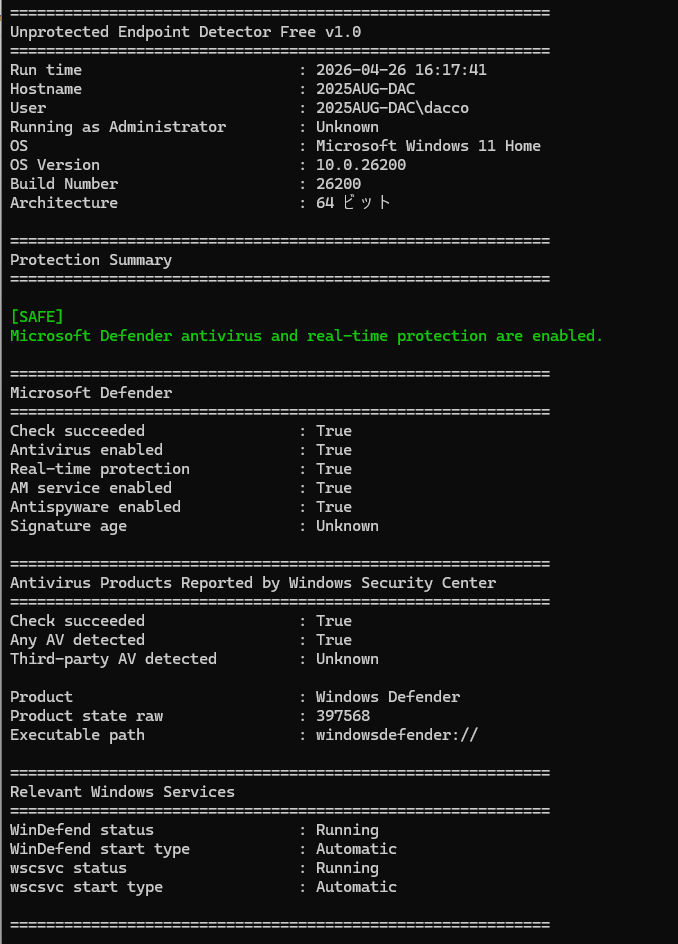
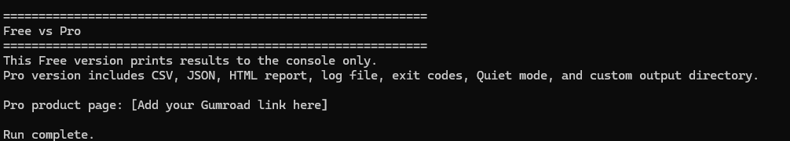

# Unprotected Endpoint Detector Free

Detect Windows endpoints with ZERO active protection.

---

## What this does

This PowerShell script checks:

- Microsoft Defender status  
- Real-time protection  
- Antivirus products reported by Windows Security Center  

It then classifies the endpoint as:

- **SAFE** → Defender active and real-time protection ON  
- **WARNING** → Partial protection or unclear state  
- **CRITICAL** → No active antivirus detected  
- **UNKNOWN** → Detection failed  

---

## Why this exists

You don’t have a visibility problem.  
You have a blind spot problem.

Some endpoints have no active protection.  
You just don’t know which ones.

Run it once. Know your risk.

---

## Free Version

The free version:

- Runs locally  
- Prints results to the console  
- Requires no installation  

## Screenshots

### Free version console output





---

## Pro Version

The Pro version adds:

- CSV report  
- JSON report  
- Color-coded HTML report  
- Execution log  
- RMM / Intune friendly exit codes  
- Quiet mode (silent execution)  
- Custom output directory  

👉 Get Pro version:  
Pro version coming soon.

---

## Usage

Run from PowerShell:

```powershell
powershell.exe -NoProfile -ExecutionPolicy Bypass -File .\SecurityAudit-Free.ps1
